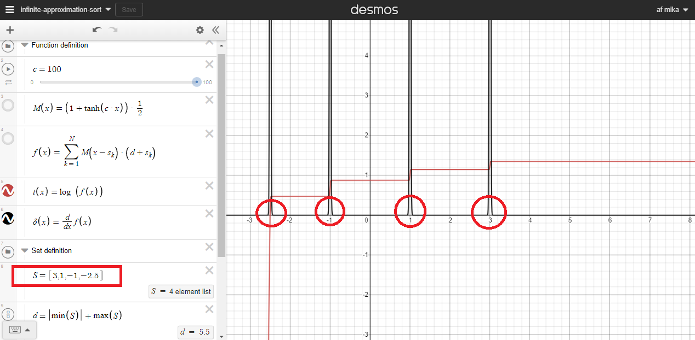
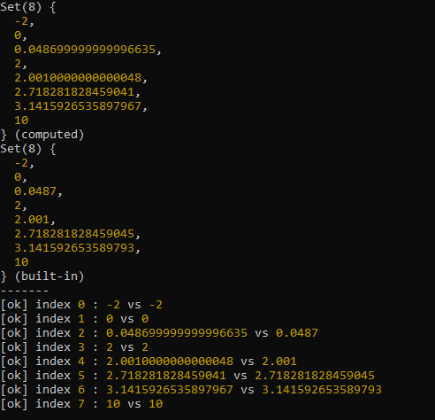

# Infinite-approximation-sort
By abusing the big O notation, it is guaranteed to be O(infinity).

# Context
Have you ever wondered if you could use the power of calculus as a basis for a sorting algorithm ?

# How does it work
Complexity O(N * 10^P) ~ O(N * exp(2.3P)) where P is the desired precision and N the size of the set.
When a member of the set has N decimals, we define P > N otherwise the result will be false
(yep it explodes quickly to infinity).
Theoretically speaking, we literally need an infinite amount of precision because we have to traverse
all numbers on the real number line for this to work in the absolute sense thus we get a time complexity that can't be represented as a big O
So let's just say, it's O(infinity) in time.

# Screenshots

